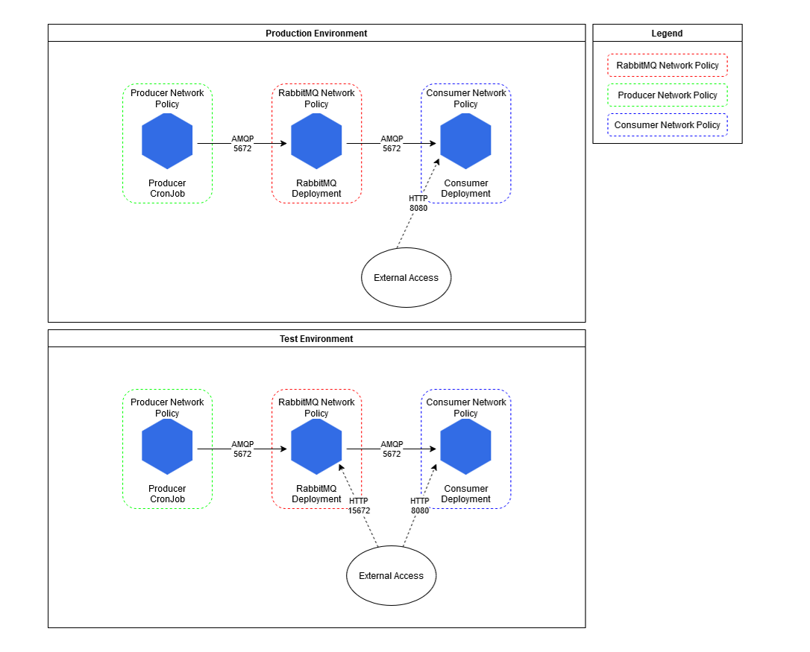

# AKTT1 Group 1 Kubernetes Deployment
```
Group 01 
Harald Beier 
Susanne Peer 
Patrick Prugger
```
# Step 2 Application - May the flower power be with you
## Branch Protection
> Activated but the rule from Github: *Your rules won't be enforced on this private repository until one of your organization's owners upgrades the account to GitHub Team or Enterprise.*

## Description for Usage
- WSL installed
- Rancher desktop installed
- IDE of Choice
- Project pulled
- Rancher desktop up and running
- To start the deployment run ./k8s/scripts/deploy-k8s.ps1
- To delete the deployment run ./k8s/scripts/delete-deployment.ps1

## Description of functionality
- Producer generates JSON with datetime in UTC
- RabbitMQ is used as messaging queue
- Consumer uses JS for visualisation of JSON with minimal functionality (Refresh, Delete and a little extra because we love it if a plan is working)
- K8S manifest includes the configuration Yamls for the different services
  
### Directory Structure

```plaintext
AKTT1-GROUP1-K8S/
|
|-- consumer/               # Source code consumer application
|-- producer/               # Source code producer application
|-- k8s/                    # Kubernetes configurations
|   |-- base/               
|       |-- consumer/       # resources (consumer)
|           |-- deployment.yaml
|           |-- networkpolicy.yaml
|           |-- service.yaml
|           |-- serviceaccount.yaml
|       |-- producer/       # resources (producer)
|       |-- rabbitmq/       # resources (RabbitMQ)
|       |-- kustomization.yaml
|   |-- overlays/           # Environment configurations (prod/test)
|-- scripts/                # Helper scripts
|-- README.md               # 🔴 You are here  
```


## Architecture diagram


## 12 Factor App 
1. **Codebase:** github used as revision control. Dev and Main branches
2. **Dependencies:** node:16-alpine for consumer and python:3.9-slim for producer, declaration in Dockerfiles
3. **Config:** Store config in the environment
4. **Backing services:** Treat backing services as attached resources
5. **Build, release, run:** Different overlays generated in K8S for test and producer.
6. **Processes:** 3 stateless processes producer, consumer and RabbitMQ
7. **Port binding:** Through 3 different networkpolicy.yaml for producer,consumer and rabbitmq
8. **Concurrency:** Scale out via the process model
9. **Disposability:** Will be managed through rancher and the scripts delete and deploy in bash in powershell
10. **Dev/prod parity:** Base and overlay folder. Additional different github branches 
11. **Logs:** Treat logs as event streams 
12. **Admin processes:** Adminmanagement from rabbitmq can be ascessed 

## Pull-Request for Step 2
- Sent to Group 2
- Sent at 2024-12-27

# Step 3: Kubernetes Application Security Checklist and implement 2-3 aspects in your manifest 
## Base security hardening
- Application design 
- Service account
- Pod-level securityContext recommendations
- Container-level securityContext recommendations 
- Role Based Access Control (RBAC) 
- Image security
- Network policies

## **Security Configuration**
### **Base Security Hardening**
1. **Pod Security Context:**
   - Non-root user execution
   - Read-only root filesystem
   - Dropped capabilities
   - RunAsUser and fsGroup defined

2. **Container Security:**
   - Resource limits enforced
   - Latest base images used
   - No privileged containers

3. **RBAC Implementation:**
   - Service accounts with minimal permissions
   - Role-based access control for components
   - Namespace isolation

### **Network Policies**
The deployment includes NetworkPolicies to control pod-to-pod communication:

*RabbitMQ NetworkPolicy:*
- Restricts AMQP port (5672) access to only Producer and Consumer pods
- Management interface (15672) access:
  - Exposed via LoadBalancer

*Consumer NetworkPolicy:*
- Allows incoming traffic on port 3000 (web server)
- Permits bi-directional AMQP communication with RabbitMQ
- Enables DNS resolution (TCP/UDP port 53)

*Producer NetworkPolicy:*
- Allows outbound AMQP communication to RabbitMQ
- Enables DNS resolution (TCP/UDP port 53)


## Pull-Request for Step 3
- Sent to Group 2
- Sent at 2024-12-27
Unfortunately we pushed here to the same branch as the previous step.
So all commits are now in the same pull request.

# Step 4: Templating (optional)
Lessons learned:
- To avoid this problem for this step we have created a new branch called "templating".


## Changes for templating
- Changed the k8s folder layout in a base folder and created an overlays folder for the test and production environment
- Moved the scripts to a scripts folder
- Created patches for prod and test environment
- prod and test are divided in different namespaces
- prod and test can be deployed on the same cluster now
- changed the deployment scripts to use the overlays
- changed the drawio file because we have a new port on prod

## Pull-Request for Step 4
- Sent to Group 2
- TBD

---

By the power of the Rose


```plaintext
⠀⠀⠀⠀⠀⠀⡤⡀⠠⡀⠀⠀⠀⠀
⠀⠀⠀⠀⠀⢀⠆⣸⠃⠊⠭⠂⣠⠀
⠀⠀⠀⠀⢠⠃⡐⠃⠀⠀⠀⡌⠱⡀
⠀⠀⠀⠀⠰⡀⡄⠀⠀⠀⡜⢀⠒⠁
⠀⠀⠀⠀⠀⢈⡟⢔⠒⣈⠔⠁⠀⠀
⠀⠀⠀⠀⠀⡼⠀⠀⠀⠀⠀⠀⠀⠀
⠀⠀⠀⠀⠰⠇⠀⠀⠀⠀⠀⠀⠀⠀
⠀⠀⠀⠀⢰⠀⠀⢀⢱⠀⠀⠀⠀⠀
⠶⡤⠄⡀⢸⠀⣠⢊⡌⠀⠀⠀⠀⠀
⠀⠈⠄⠈⢢⠊⡡⠋⠀⠀⠀⠀⠀⠀
⠀⠀⠸⠀⠀⢠⠁⠀⠀⠀⠀⠀⠀⠀
⠀⠀⠀⠡⡈⢜⡀⣀⠀⠀⠀⠀⠀⠀
⠀⠀⠀⠀⠈⠒⠓⠃⠀⠀⠀⠀⠀⠀
```